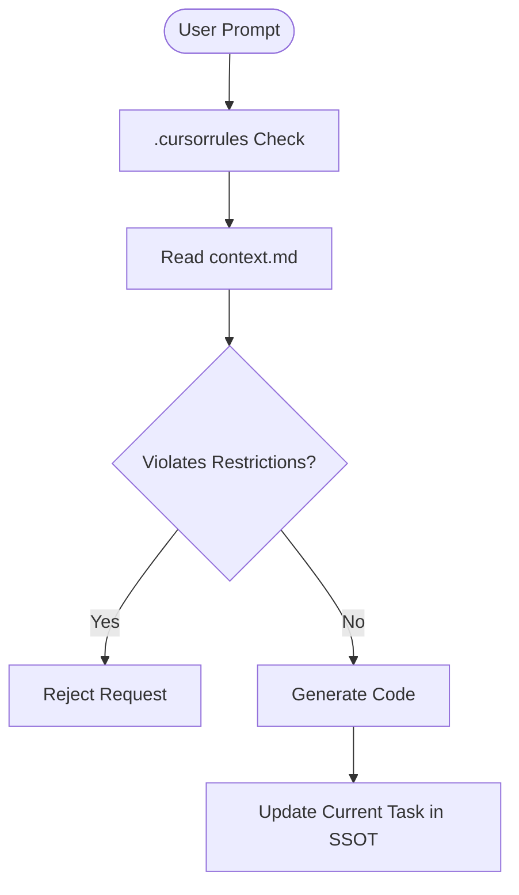

# 🏆 G.R.I.A.L. Methodology

**Grounding • Restrictions • Itinerary • Architecture • Launch**

> **The first AI-Native Development Framework designed to prevent LLM hallucination and context drift.**
> _A strict SSOT (Single Source of Truth) protocol for High-Velocity Solo Developers, Vibe Coders, and Centaurs._

## 🛑 The Problem

Traditional methodologies (Scrum, Agile) manage _people_. They fail when your teammate is an AI that writes 100 lines of code per second but loses context every 10 minutes.

In the era of **Vibe Coding**, the bottleneck is no longer syntax; it is **Context Integrity**. Without strict guardrails, AI development leads to:

- **Scope Creep:** The AI suggests "cool" features that kill the MVP.
- **Context Drift:** The AI forgets the tech stack or early architectural decisions.
- **Spaghetti Code:** Circular dependencies created by short-term memory patches.

## 🛡️ The Solution: G.R.I.A.L. & The SSOT Protocol

G.R.I.A.L. is not just a philosophy; it is a technical implementation using two critical files to lock the AI into a "State of Truth".

### 1. The Guard (`.cursorrules`)

A strict, minimal instruction set that forces the AI to read the documentation before every single action. It acts as the "Gatekeeper".

### 2. The Brain (`context.md`)

The **Single Source of Truth (SSOT)**. It contains the G.R.I.A.L. pillars, the Tech Stack, the Route Inventory, and the Current Task.

---

## 🏛️ The 5 Pillars of G.R.I.A.L.

These pillars MUST be defined in your SSOT file:

#### 1. G - Grounding (The North Star)

A single sentence that defines the _only_ problem the application solves. Use this to reject unnecessary features.

#### 2. R - Restrictions (The Anti-Roadmap)

A list of explicitly **banned** features (Negative Scope). This physically stops the AI from over-engineering.

#### 3. I - Itinerary (The Happy Path)

A strictly linear user flow. We do not code for edge cases in V1.

> **Standard:** Use **Mermaid.js** syntax in your SSOT to visualize this flow.

#### 4. A - Architecture (The Domain Model)

Identification of the "God Entity" and the Route Inventory. The AI is forbidden from inventing routes or tables not listed here.

#### 5. L - Launch Criteria (Definition of Done)

A binary, verifiable condition for deployment. It stops the loop of eternal polishing.

---

## ⚙️ How it Works (The Workflow)

### The Setup

1. Place `.cursorrules` in your root. It tells the AI: _"Read `context.md` before doing anything."_
2. Fill out `context.md` with your Project Context, Stack, and Pillars.

### The Loop (Vibe Coding)

